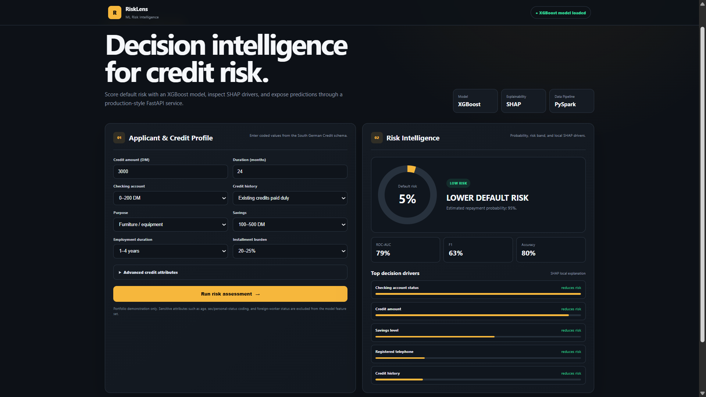
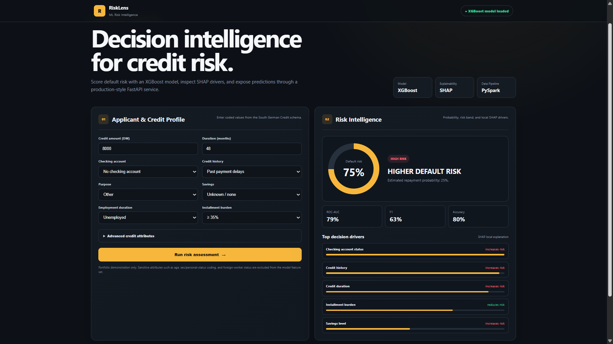

# RiskLens — Production ML Risk Intelligence Platform

## Screenshots

### Low Risk Prediction


### High Risk Prediction


## What It Does

RiskLens predicts credit default risk, assigns a **LOW / MODERATE / HIGH** risk band, and explains the strongest decision drivers behind each prediction.

## Model

- XGBoost
- SHAP Explainability
- South German Credit Dataset
- PySpark ETL with pandas fallback
- FastAPI inference service

## Results

- ROC-AUC: **79%**
- Accuracy: **80%**
- F1 Score: **63%**

Example predictions:

- Low-risk profile → **5% default risk**
- High-risk profile → **75% default risk**

## Tech Stack

Python · XGBoost · SHAP · PySpark · pandas · scikit-learn · FastAPI · Docker · Kubernetes · GitHub Actions · HTML · CSS · JavaScript

## Train the Model

```powershell
$env:RISK_ETL_ENGINE="pandas"
.\.venv\Scripts\python.exe -m training.train_all